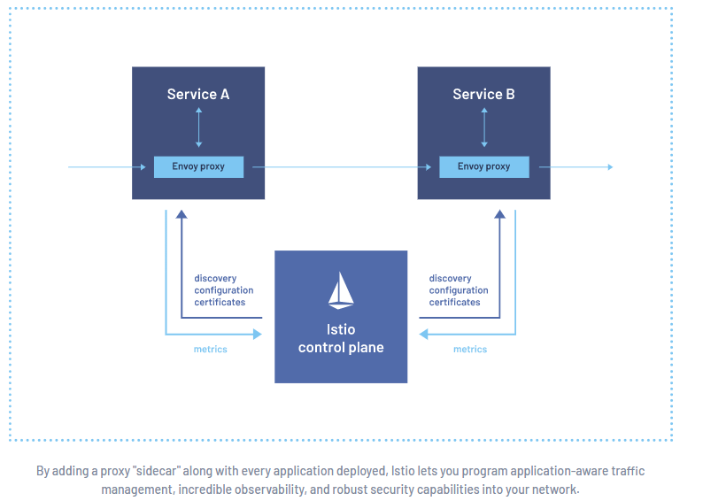

# **Treinamentos  Istio**

Colocar ✔ quando concluído. 

# **Treinamentos**

## **LinuxTips - Descomplicando o Istio** 

## Descomplicando o Istio - Aula ao Vivo

https://www.youtube.com/watch?v=Qk7FFBby43U&t=2s

## Service-Mesh: uma visão aprofundada das tecnologias e razões para adoção

https://www.infoq.com/br/presentations/service-mesh-razoes-para-adocao/

## Service Mesh e Sidecars com Istio e Envoy

https://www.infoq.com/br/presentations/service-mesh-sidecars-istio-envoy/

## Service Mesh e Sidecars: Escrevendo aplicações com Istio e Envoy | ⚡ Zup Insights 

https://www.youtube.com/watch?v=MLIdQ9YwiNY

## Solucionando Problemas de Microsserviços com Service Mesh: Istio e Envoy - Edson Yanaga

https://www.youtube.com/watch?v=AWpsmh47pIk

## Service Mesh e Sidecars com Istio e Envoy - Rafael Benevides

https://www.youtube.com/watch?v=aGnMREnH5A8

## Docker e Envoy: Proxy Reverso, Service Mesh

https://www.youtube.com/watch?v=c9vfAjMrKeQ

## Intensivão Microsserviços - Aula 4 (Istio / Service Mesh)

https://www.youtube.com/watch?v=2dHEEle6mUE

## The Istio service mesh

https://istio.io/latest/about/service-mesh/

## O que é o Istio?

https://cloud.google.com/learn/what-is-istio?hl=pt-br

## Istio — Parte 1 — Introdução simplificando a arquitetura de microserviços

https://medium.com/codigorefinado/istio-parte-1-introdu%C3%A7%C3%A3o-simplificando-a-arquitetura-de-microservi%C3%A7os-7a5822934d28

## Entendendo Istio e Service Mesh

https://www.youtube.com/watch?v=Txv9CQoUEL8

# **Anotações**

**O que é:**

O Istio é uma malha de serviço, uma camada de rede de serviço modernizada que fornece uma maneira transparente e independente da linguagem para automatizar de modo flexível e fácil as funções de rede do aplicativo. 

### Definição do Istio

O Istio é uma malha de serviço de código aberto que ajuda as organizações a executar aplicativos distribuídos baseados em microsserviços em qualquer lugar. Por que usar o Istio? Com o Istio, as organizações podem proteger, conectar e monitorar microsserviços para modernizar os aplicativos empresariais com mais rapidez e segurança.

# **Comandos**

|                           Comando                            | Descrição                     |
| :----------------------------------------------------------: | :---------------------------- |
| curl -L https://git.io/getLatestIstio \|ISTIO_VERSION=1.10.2 sh - | Download Istio                |
|     https://istio.io/latest/docs/setup/getting-started/      | Setup Istio                   |
| kubectl port-forward svc/"nomedoserviço" porta:porta -n "namespace" --address=0.0.0.0 | Exportar a aplicação para web |
|                                                              |                               |
|                                                              |                               |
|                                                              |                               |
|                                                              |                               |
|                                                              |                               |
|                                                              |                               |
|                                                              |                               |
|                                                              |                               |
|                                                              |                               |
|                                                              |                               |
|                                                              |                               |
|                                                              |                               |
|                                                              |                               |
|                                                              |                               |
|                                                              |                               |
|                                                              |                               |
|                                                              |                               |
|                                                              |                               |
|                                                              |                               |
|                                                              |                               |
|                                                              |                               |
|                                                              |                               |
|                                                              |                               |
|                                                              |                               |
|                                                              |                               |
|                                                              |                               |

# **Best Practices**

